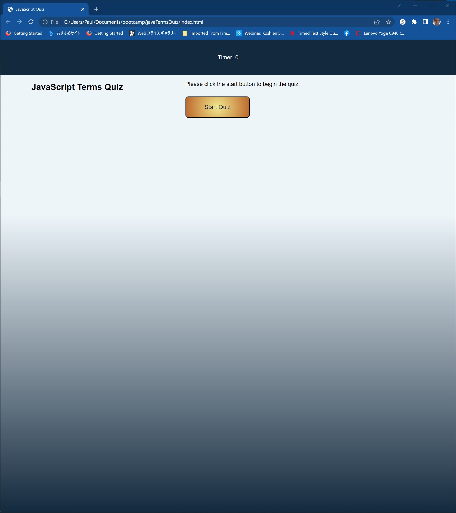
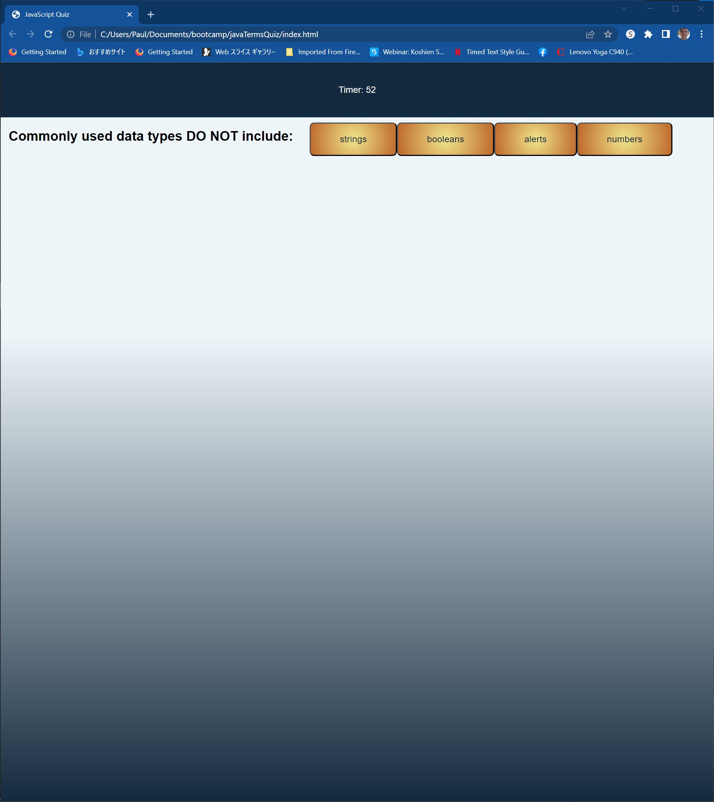

# JavaScript Quiz

## Description

This is a quiz application which gives users 5 multiple choice questions to test their knowledge of JavaScript.

## Location

The site is live at the following URL:
[https://pk50sshowa.github.io/javaTermsQuiz/index.html](https://pk50sshowa.github.io/javaTermsQuiz/index.html)

## Screenshots

## Developer Comments

After starting the quiz, a 60 second timer is started. Players get 10 points for guessing a question correctly, but if they make a mistake, 10 seconds are subtracted from the timer.
The game ends when either 60 seconds have passed or all questions have been answered.
When finished, players can enter their initials, which will be displayed with their final score (max score: 50 points.)

## Contributing

Please take a look at the code history at this project's repo page:
[https://github.com/pk50sshowa/javaTermsQuiz/](https://github.com/pk50sshowa/javaTermsQuiz/)

## Support

Any questions can be directed to the developer at paul.koehler@gmail.com

## Credits

A huge thank you to Sehrish Khan, who helped walk me through the last portion of the output!

## License

[MIT](https://choosealicense.com/licenses/mit/)